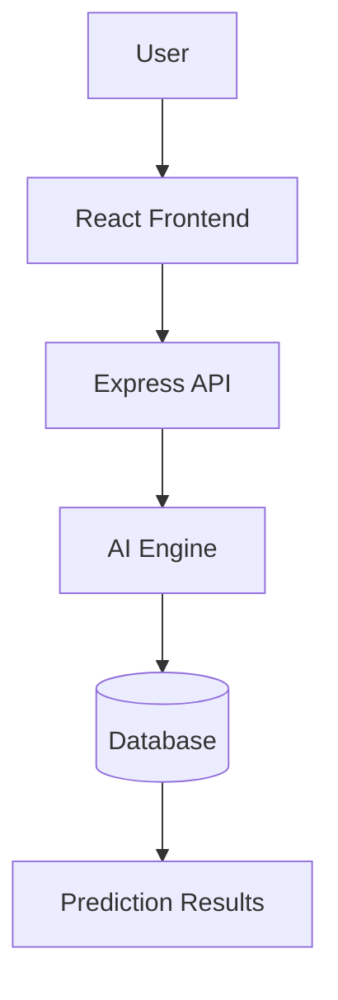

## BHARAT DRISHTI

Governance that predicts, not just reacts.

An AI-powered predictive governance platform that helps governments anticipate risks such as floods, school dropouts, child marriages, disease outbreaks, and crop failures before they happen.

## Problem

Governments often respond after disasters or social issues occur.

Bharat Drishti uses AI to predict high-risk regions early, enabling preventive action instead of reactive response.

## Solution

Bharat Drishti combines AI forecasting, geospatial visualization, and risk analysis to provide actionable insights for administrators.

## Features

- AI Risk Prediction
- Interactive India Map
- District Risk Scores
- Disaster Forecasting
- Child Marriage Prediction
- School Dropout Prediction
- Healthcare Risk Analysis
- Real-time Dashboard
- AI Insights

## Tech Stack

### Frontend
- React
- Vite
- Tailwind CSS
- Radix UI
- React Router
- Framer Motion

### Backend
- Node.js
- Express.js

### Database
- SQLite

### AI
- OpenAI
- LangGraph

### Visualization
- Recharts

### Maps
- Leaflet / MapLibre

## Architecture



# Installation

## Prerequisites

Before running the project, make sure you have:

- Node.js (v20 or later recommended)
- npm
- Git

## Clone the Repository

```bash
git clone https://github.com/your-username/Bharat-Drishti.git
```

## Navigate to the Project

```bash
cd Bharat-Drishti
```

## Install Dependencies

### Root Dependencies

```bash
npm install
```

### Frontend Dependencies

```bash
npm install --prefix web
```

## Run the Development Server

```bash
npm run dev --prefix web
```

The application will be available at:

```
http://localhost:3000
```

---

# Folder Structure

```text
Bharat-Drishti/
│
├── web/                     # React + Vite Frontend
│   ├── public/
│   ├── src/
│   │   ├── components/      # Reusable UI Components
│   │   ├── pages/           # Application Pages
│   │   ├── hooks/           # Custom React Hooks
│   │   ├── lib/             # Utility Functions
│   │   ├── assets/          # Images, Icons
│   │   ├── styles/          # Global Styles
│   │   ├── App.jsx
│   │   └── main.jsx
│   │
│   ├── package.json
│   └── vite.config.js
│
├── server/                  # Express Backend (Future)
│
├── docs/                    # Documentation & Screenshots
│
├── package.json             # Root Configuration
├── package-lock.json
└── README.md
```

---

# Future Scope

Bharat Drishti is designed as a scalable national intelligence platform. Future enhancements include:

- AI-powered disaster prediction using satellite imagery.
- Real-time weather and climate forecasting.
- Child marriage risk prediction using demographic indicators.
- School dropout prediction and intervention recommendations.
- Disease outbreak forecasting.
- Crop failure prediction for agricultural planning.
- District-wise governance performance dashboards.
- Smart resource allocation recommendations.
- Multi-language support for all Indian states.
- Citizen reporting and grievance integration.
- Mobile application for field officers.
- Offline data collection and synchronization.
- Integration with government open-data platforms.
- Advanced AI agents for automated policy recommendations.
- Predictive analytics for healthcare, education, agriculture, and public safety.
- National command center with real-time monitoring and alerts.

---

# Beyond a Project

> **"A great nation is not defined by how it responds to crises, but by how well it prevents them."**

**Bharat Drishti** is our vision for the future of governance—where Artificial Intelligence helps leaders see risks before they become disasters, enabling timely action that protects lives, strengthens communities, and builds a more resilient nation.

### 🇮🇳 Predict Today. Prevent Tomorrow. Protect Forever.